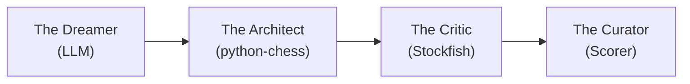

# ♟️ CAISSA: The Aesthetic Chess Engine

> **"We don't generate chess games. We generate immortality."**

## 📜 Executive Summary

CAISSA is a Generative Adversarial-Cooperative Pipeline (GACP) that combines Large Language Model narrative creativity with Stockfish tactical verification to generate "Perfect" chess games—sound enough to be real, dramatic enough to be masterpieces.

Unlike traditional engines that optimize for a single metric (strength), CAISSA optimizes for **Beauty**: the intersection of tactical soundness, strategic coherence, and aesthetic brilliance.

## 📚 Documentation

| File | Purpose |
|------|---------|
| [QUICKSTART.md](QUICKSTART.md) | Get running in 10 minutes |
| [PROVIDER_QUICK_REFERENCE.md](PROVIDER_QUICK_REFERENCE.md) | One-liner examples for all 6 providers |
| [CONTRIBUTING.md](CONTRIBUTING.md) | How to contribute |
| [docs/SETUP.md](docs/SETUP.md) | Complete installation & configuration |
| [docs/PROVIDERS.md](docs/PROVIDERS.md) | Full provider guide with troubleshooting |
| [docs/ARCHITECTURE.md](docs/ARCHITECTURE.md) | Deep technical design |
| [docs/DEVELOPMENT.md](docs/DEVELOPMENT.md) | Contributing & code standards |
| [docs/ROADMAP.md](docs/ROADMAP.md) | Full project vision & timeline |
| [docs/LLM_VS_LLM.md](docs/LLM_VS_LLM.md) | LLM vs LLM tournament architecture |
| [docs/MODE_CONTRACTS.md](docs/MODE_CONTRACTS.md) | Mode-specific validation/export contracts |

## 🏗️ Architecture Overview



## 📁 Directory Structure

```
Caissa-Chess/
├── main.py                      # Unified interactive CLI entry point
├── caissa.py                    # Legacy CLI interface
├── config_manager.py            # YAML configuration loader & dataclasses
├── log_manager.py               # Structured logging infrastructure
├── caissa_config.yaml           # User-facing configuration file
├── conftest.py                  # Pytest fixtures & shared test config
│
├── core/                        # Main generation pipeline
│   ├── generator.py             # Primary orchestrator
│   ├── batch_engine.py          # Advanced batch generation engine
│   ├── board_state.py           # Chess board wrapper
│   ├── llm_provider.py          # Multi-provider LLM abstraction + metrics
│   ├── prompt_manager.py        # Dynamic prompt assembly (5-mode bias)
│   ├── model_discovery.py       # 3-tier Gemini model discovery
│   └── provider_factory.py      # Provider instantiation factory
│
├── engine/                      # Validation & analysis
│   ├── stockfish_client.py      # UCI protocol wrapper
│   └── legality.py              # Move validation
│
├── aesthetic/                   # Beauty evaluation
│   ├── beauty_eval.py           # Brilliance scoring algorithm
│   └── style_slider.py          # Style presets (Tal, Capablanca, etc)
│
├── benchmarks/                  # Performance & quality analysis
│   ├── provider_benchmark.py    # Multi-provider benchmarking
│   ├── rich_console.py          # Color output & charts
│   ├── quality_analyzer.py      # Game quality scoring
│   ├── benchmark_history.py     # Trend analysis & persistence
│   └── report_generator.py      # HTML/Markdown reports
│
├── export/                      # Output formatting
│   ├── game_exporter.py         # Unified export pipeline (PGN/HTML/MD/JSON)
│   ├── pgn_builder.py           # PGN formatting & NAG annotations
│   └── annotation_parser.py     # Annotation parsing utilities
│
├── data/                        # Reference data
│   └── openings.json            # ECO codes & opening book
│
├── tests/                       # Test suite (933 tests)
│   ├── 25 test modules covering all subsystems
│   └── conftest.py
│
├── scripts/                     # Utility scripts
│   ├── list_gemini_models.py
│   └── list_gemini_models_verbose.py
│
├── tal_games/                   # Reference GM game collection
│   └── game_001–005.pgn
│
└── docs/                        # Comprehensive documentation
    ├── ARCHITECTURE.md
    ├── DEVELOPMENT.md
    ├── PROVIDERS.md
    ├── ROADMAP.md
    ├── SETUP.md
    └── LLM_VS_LLM.md
```

## ✨ Features

- **🌐 Multi-Provider Support**: OpenAI, Anthropic (Claude), Azure OpenAI, Google Gemini, or 100% FREE & PRIVATE local models via Ollama
- **🎨 LLM-Powered Generation**: Advanced AI proposes creative, high-entropy moves with narrative intent
- **✅ Legality Enforcement**: Every move validated through `python-chess`
- **🔄 Self-Correction Loop**: Automatic illegal-move detection with configurable retry strategies
- **💎 Beauty Metrics**: Mathematical scoring of aesthetic qualities (sacrifices, tension, quiet brilliance)
- **🎭 Style Injection**: 15 historical player personalities (Tal, Capablanca, Fischer, Kasparov, AlphaZero, etc.)
- **🎯 5-Mode Bias System**: White / Black / Draw / Random / Neutral — let the LLM choose or force an outcome
- **📦 Multi-Format Export**: PGN, HTML, Markdown, JSON with FEN position headers
- **🔄 Batch Generation**: Generate multiple games with animated chess-piece spinner and progress bar
- **📊 Provider Benchmarking**: Rich console output, trend analysis, regression detection
- **🔍 Model Discovery**: Automatic 3-tier Gemini model enumeration (SDK / REST / hardcoded)
- **📝 Structured Logging**: Configurable console + file logging with rotation
- **⚙️ YAML Configuration**: Single `caissa_config.yaml` for all settings

## 🚀 Quick Start

```bash
# Install dependencies
poetry install

# Set up your preferred provider (choose one):
export OPENAI_API_KEY='sk-...'              # For OpenAI (GPT-4)
export ANTHROPIC_API_KEY='sk-ant-...'       # For Anthropic (Claude)
export GOOGLE_API_KEY='...'                 # For Google Gemini
# OR use Ollama for FREE local models (no key needed)

# Launch the interactive CLI
python main.py

# Or run a quick demo
python script_multi_provider_demo.py
```

### CLI Usage

```bash
# Interactive mode (guided prompts)
python main.py

# Single game generation
python main.py --provider gemini --bias neutral --moves 30

# Batch generation (10 games)
python main.py --batch 10 --provider openai --bias random

# Preview prompts without calling the LLM
python script_preview_prompts.py --bias white black neutral
```

### Configuration

Edit `caissa_config.yaml` to set defaults:
```yaml
generation:
  provider: "gemini"
  model: "gemini-2.0-flash"
  bias: "neutral"           # white | black | draw | random | neutral
  moves: 30
  temperature: 0.8

logging:
  console_logs: true
  file_logs: true
  log_level: "INFO"
```

**See [docs/PROVIDERS.md](docs/PROVIDERS.md) for detailed setup of all 6 LLM providers.**

## 💎 The Beauty Score Formula

$$\text{Beauty} = (\text{Sacrifices} \times 3) + (\text{Tension} \times 2) + (\text{Quiet Moves} \times 4) - (\text{Draws} \times 5)$$

## 🎛️ Style Presets

| Style | Depth | Blunder Tolerance | Best For |
|-------|-------|-------------------|----------|
| **Tal** | 10 | High (-2.0) | Intuitive attacks, complications |
| **Capablanca** | 20 | Zero | Positional perfection |
| **Coffee House** | Very Low | Very High | Gambits and tricks |
| **Neural** | Max | Zero | AlphaZero-style sacrifices |

### 🎭 Historical Player Personalities

| Player | Era | Style | Aggression |
|--------|-----|-------|------------|
| **Morphy** | Romantic | Classical development, rapid attacks | 7/10 |
| **Tal** | Soviet | Wild sacrifices, magical combinations | 9/10 |
| **Capablanca** | Classical | Crystal-clear logic, endgame perfection | 4/10 |
| **Fischer** | Computer | Perfect calculation, crushing technique | 7/10 |
| **Kasparov** | Computer | Relentless attacking power | 8/10 |
| **Carlsen** | Neural | Universal style, grinding technique | 5/10 |
| **AlphaZero** | Neural | Alien logic, long-term sacrifices | 6/10 |

## 🎯 Bias System

| Mode | Result | Description |
|------|--------|-------------|
| **white** | `1-0` | Force White to win |
| **black** | `0-1` | Force Black to win |
| **draw** | `1/2-1/2` | Force a draw |
| **random** | Random | Randomly assign 1-0, 0-1, or 1/2-1/2 each game |
| **neutral** | LLM decides | Let the LLM choose the most dramatically satisfying result |

## 📊 Benchmarking & Quality

```bash
# Rich console output with colors and charts
python -m benchmarks.provider_benchmark --all --rich

# Generate HTML report
python -m benchmarks.provider_benchmark --all --report benchmark.html

# Analyze performance trends over time
python -m benchmarks.benchmark_history --provider openai --trends
```

## 📋 Development Roadmap

See [docs/ROADMAP.md](docs/ROADMAP.md) for the complete project timeline and vision.

**Current Status**:
- ✅ **v0.1**: Core generation pipeline (legality validation)
- ✅ **v0.2**: Multi-provider LLM support (6 providers)
- ✅ **v0.3**: Stockfish integration + Phase 3.1 enhancements
  - Batch generation, 15 player personalities, NAG annotations, multi-format export
- ✅ **v0.3.1**: Quality & Testing (Phase 3.2)
  - Provider metrics (tokens, cost, latency), live API testing
- ✅ **v0.3.2**: Enhanced Benchmarking (Phase 3.2+)
  - Rich console, trend analysis, regression detection, HTML reports
- ✅ **v0.4.0**: Interactive CLI & Configuration Overhaul
  - Unified CLI (`main.py`), YAML config, 5-mode bias system, batch engine with animated spinner
  - FEN/FinalFEN position headers, structured logging, model discovery, provider factory
  - 933 tests passing across 25 test modules
- 📋 **v0.5.0**: LLM vs LLM Tournament Mode (Planned)
  - Move-by-move generation with two LLMs alternating
  - Tournament brackets and ELO tracking
  - See [docs/LLM_VS_LLM.md](docs/LLM_VS_LLM.md) for architecture
- 📋 **v0.6.0**: Web Interface & API (Planned)
  - FastAPI backend, Next.js frontend, real-time generation
- 🎯 **v1.0**: Production-ready release

## 🔬 Research Applications

CAISSA is positioned as "Alignment Research in Game Aesthetics" — exploring how to generate strategic content that entertains *and* instructs humans, not just maximizes ELO.

Key metrics:
- **Memorability**: Can humans recall the key position?
- **Instructional Value**: Does the game teach a clear thematic concept?
- **Human-Likeness**: Turing test against GM game databases

## 📜 License

MIT

---

**Status**: `✅ Stable Release`
**Version**: v0.4.0 (Interactive CLI & Configuration Overhaul)
**Last Updated**: March 2026
**Tests**: 933 passing, 13 skipped ✅
