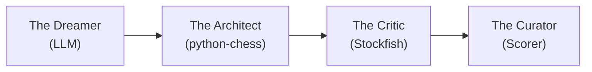

# ♟️ CAISSA: The Aesthetic Chess Engine

> **"We don't generate chess games. We generate immortality."**

## 📜 Executive Summary

CAISSA is a Generative Adversarial-Cooperative Pipeline (GACP) that combines Large Language Model narrative creativity with Stockfish tactical verification to generate "Perfect" chess games—sound enough to be real, dramatic enough to be masterpieces.

Unlike traditional engines that optimize for a single metric (strength), CAISSA optimizes for **Beauty**: the intersection of tactical soundness, strategic coherence, and aesthetic brilliance.

## 🏗️ Architecture Overview



## 📁 Directory Structure

```
Caissa-Chess/
├── core/                    # Main generation pipeline
│   ├── generator.py         # Primary orchestrator
│   ├── board_state.py       # Chess board wrapper
│   └── prompt_manager.py    # Dynamic prompt assembly
│
├── engine/                  # Validation & analysis
│   ├── stockfish_client.py  # UCI protocol wrapper
│   ├── legality.py          # Move validation
│   └── tac_search.py        # Tactical pattern detection
│
├── aesthetic/               # Beauty evaluation
│   ├── beauty_eval.py       # Brilliance scoring algorithm
│   ├── style_slider.py      # Style presets (Tal, Capablanca, etc)
│   └── sacrifice_detector.py
│
├── export/                  # Output formatting
│   ├── pgn_builder.py       # PGN formatting
│   ├── gif_generator.py     # Board visualization
│   └── markdown_report.py   # Game narrative
│
├── data/                    # Reference data
│   ├── openings.json        # ECO codes
│   └── master_styles/       # Few-shot examples
│
├── tests/                   # Test suite
└── README.md
```

## ✨ Features

- **LLM-Powered Generation**: Uses Claude/OpenAI to propose high-entropy moves
- **Legality Enforcement**: Every move validated through `python-chess`
- **Beauty Metrics**: Mathematical scoring of aesthetic qualities
- **Style Injection**: Generate games in historical styles (Romantic, Hypermodern, Neural)
- **GM Commentary**: Auto-annotation explaining brilliant and curious moves
- **PGN Export**: Professional publication-ready format

## 🚀 Quick Start

```bash
# Install dependencies
poetry install

# Generate a game (example)
python -m caissa.core.generator --style romantic --theme "Queen Sacrifice"
```

## 💎 The Beauty Score Formula

$$\text{Beauty} = (\text{Sacrifices} \times 3) + (\text{Tension} \times 2) + (\text{Quiet Moves} \times 4) - (\text{Draws} \times 5)$$

See `docs/beauty_metric.md` for the full mathematical framework.

## 🎛️ Style Presets

| Style | Depth | Blunder Tolerance | Best For |
|-------|-------|-------------------|----------|
| **Tal** | 10 | High (-2.0) | Intuitive attacks, complications |
| **Capablanca** | 20 | Zero | Positional perfection |
| **Coffee House** | Very Low | Very High | Gambits and tricks |
| **Neural** | Max | Zero | AlphaZero-style sacrifices |

## 📋 Development Roadmap

- [ ] **v0.1**: Core generation pipeline (legality validation)
- [ ] **v0.2**: Beauty scoring algorithm
- [ ] **v0.3**: CLI tool for game generation
- [ ] **v0.5**: "Turing Test" mode
- [ ] **v1.0**: Web interface with visualization

## 🔬 Research Applications

CAISSA is positioned as "Alignment Research in Game Aesthetics"—exploring how to generate strategic content that entertains *and* instructs humans, not just maximizes ELO.

Key metrics:
- **Memorability**: Can humans recall the key position?
- **Instructional Value**: Does the game teach a clear thematic concept?
- **Human-Likeness**: Turing test against GM game databases

## 📜 License

MIT

---

**Status**: `🔧 In Active Development`  
**Last Updated**: January 31, 2026
