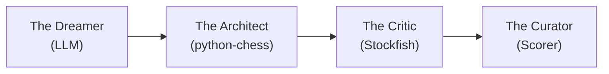

# ♟️ CAISSA: The Aesthetic Chess Engine

> **"We don't generate chess games. We generate immortality."**

## 📜 Executive Summary

CAISSA is a Generative Adversarial-Cooperative Pipeline (GACP) that combines Large Language Model narrative creativity with Stockfish tactical verification to generate "Perfect" chess games—sound enough to be real, dramatic enough to be masterpieces.

Unlike traditional engines that optimize for a single metric (strength), CAISSA optimizes for **Beauty**: the intersection of tactical soundness, strategic coherence, and aesthetic brilliance.

## 📚 Documentation

### 🚀 Quick References (Root)
| File | Purpose |
|------|---------|
| [QUICKSTART.md](QUICKSTART.md) | Get running in 10 minutes |
| [PROVIDER_QUICK_REFERENCE.md](PROVIDER_QUICK_REFERENCE.md) | One-liner examples for all 6 providers |
| [ARCHITECTURE.md](ARCHITECTURE.md) | System overview |
| [DEVELOPMENT_ROADMAP.md](DEVELOPMENT_ROADMAP.md) | Current status & what's next |

### 📚 Comprehensive Guides (docs/)
| File | Purpose |
|------|---------|
| [docs/SETUP.md](docs/SETUP.md) | Complete installation & configuration |
| [docs/PROVIDERS.md](docs/PROVIDERS.md) | Full provider guide with troubleshooting |
| [docs/ARCHITECTURE.md](docs/ARCHITECTURE.md) | Deep technical design |
| [docs/DEVELOPMENT.md](docs/DEVELOPMENT.md) | Contributing & code standards |
| [docs/ROADMAP.md](docs/ROADMAP.md) | Full project vision & timeline |

## 🏗️ Architecture Overview



## 📁 Directory Structure

```
Caissa-Chess/
├── core/                    # Main generation pipeline
│   ├── generator.py         # Primary orchestrator
│   ├── board_state.py       # Chess board wrapper
│   └── prompt_manager.py    # Dynamic prompt assembly
│
├── engine/                  # Validation & analysis
│   ├── stockfish_client.py  # UCI protocol wrapper
│   ├── legality.py          # Move validation
│   └── tac_search.py        # Tactical pattern detection
│
├── aesthetic/               # Beauty evaluation
│   ├── beauty_eval.py       # Brilliance scoring algorithm
│   ├── style_slider.py      # Style presets (Tal, Capablanca, etc)
│   └── sacrifice_detector.py
│
├── export/                  # Output formatting
│   ├── pgn_builder.py       # PGN formatting
│   ├── gif_generator.py     # Board visualization
│   └── markdown_report.py   # Game narrative
│
├── data/                    # Reference data
│   ├── openings.json        # ECO codes
│   └── master_styles/       # Few-shot examples
│
├── tests/                   # Test suite
└── README.md
```

## ✨ Features

- **🌐 Multi-Provider Support**: Use OpenAI, Anthropic (Claude), Azure OpenAI, Google Gemini, or run 100% FREE & PRIVATE with local models via Ollama
- **🎨 LLM-Powered Generation**: Uses advanced AI to propose creative, high-entropy moves
- **✅ Legality Enforcement**: Every move validated through `python-chess`
- **🔄 Self-Correction Loop**: Automatically detects and fixes illegal moves with retry logic
- **💎 Beauty Metrics**: Mathematical scoring of aesthetic qualities
- **🎭 Style Injection**: Generate games in historical styles (Romantic, Hypermodern, Neural)
- **📝 GM Commentary**: Auto-annotation explaining brilliant and curious moves
- **📦 PGN Export**: Professional publication-ready format

## 🚀 Quick Start

```bash
# Install dependencies
poetry install

# Set up your preferred provider (choose one):
export OPENAI_API_KEY='sk-...'              # For OpenAI (GPT-4)
export ANTHROPIC_API_KEY='sk-ant-...'      # For Anthropic (Claude)
# OR use Ollama for FREE local models (see MULTI_PROVIDER_GUIDE.md)

# Run the demo script
python script_multi_provider_demo.py

# Or generate programmatically:
from core.llm_provider import OpenAIProvider  # or AnthropicProvider, OllamaProvider
from core.generator import GameGenerator
from core.prompt_manager import PromptManager

provider = OpenAIProvider(model="gpt-4")
prompt_manager = PromptManager()
generator = GameGenerator(provider, prompt_manager)

game = generator.generate_game(
    aesthetic_goal="Romantic attacking chess with sacrifices",
    move_limit=15
)

print(game.pgn_str)
```

**💡 See [PROVIDERS.md](docs/PROVIDERS.md) for detailed setup of all 6 LLM providers!**

## 💎 The Beauty Score Formula

$$\text{Beauty} = (\text{Sacrifices} \times 3) + (\text{Tension} \times 2) + (\text{Quiet Moves} \times 4) - (\text{Draws} \times 5)$$

See `docs/beauty_metric.md` for the full mathematical framework.

## 🎛️ Style Presets

| Style | Depth | Blunder Tolerance | Best For |
|-------|-------|-------------------|----------|
| **Tal** | 10 | High (-2.0) | Intuitive attacks, complications |
| **Capablanca** | 20 | Zero | Positional perfection |
| **Coffee House** | Very Low | Very High | Gambits and tricks |
| **Neural** | Max | Zero | AlphaZero-style sacrifices |

## 📋 Development Roadmap

See [ROADMAP.md](docs/ROADMAP.md) for complete project timeline and vision.

**Current Status**: 
- ✅ **v0.1**: Core generation pipeline (legality validation)
- ✅ **v0.2**: Multi-provider LLM support (6 providers, 49 tests passing)
- 🚀 **v0.2.1**: API testing & validation (next)
- 📋 **v0.3**: Stockfish integration (planned)
- 🎯 **v1.0**: Production-ready web interface

## 🔬 Research Applications

CAISSA is positioned as "Alignment Research in Game Aesthetics"—exploring how to generate strategic content that entertains *and* instructs humans, not just maximizes ELO.

Key metrics:
- **Memorability**: Can humans recall the key position?
- **Instructional Value**: Does the game teach a clear thematic concept?
- **Human-Likeness**: Turing test against GM game databases

## 📜 License

MIT

---

**Status**: `🔧 In Active Development`  
**Version**: v0.2.0 (Multi-Provider LLM Integration)  
**Last Updated**: February 3, 2026
